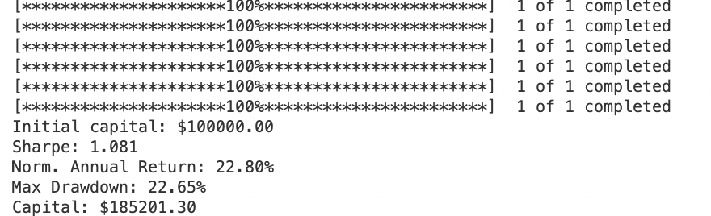
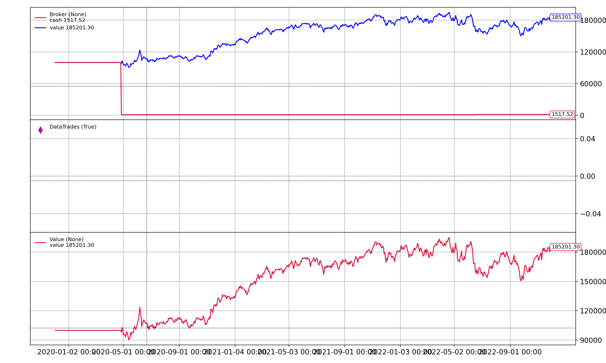

# Momentum Strategy

## Requirements

# Metric 

## Back Testing
The strategy was tested on past 3 years S&P 500 companies data (start date is 20191201 and end date is 20221201) where initial capital is 100000 and commission fee is set to 1%.

## Result

---

