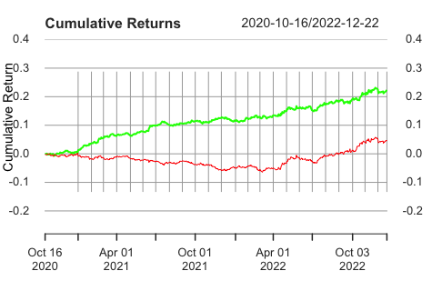
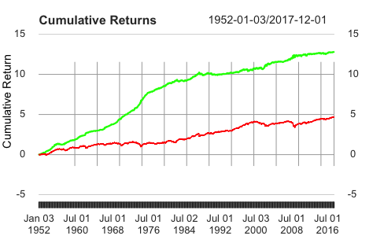

# Time Series Analysis

Successfully implement strategy with generated trading signal based on GARCH model in R, and compared the strategy return with benchmark return.

## Result

 

------------------------------------------------------------------------
